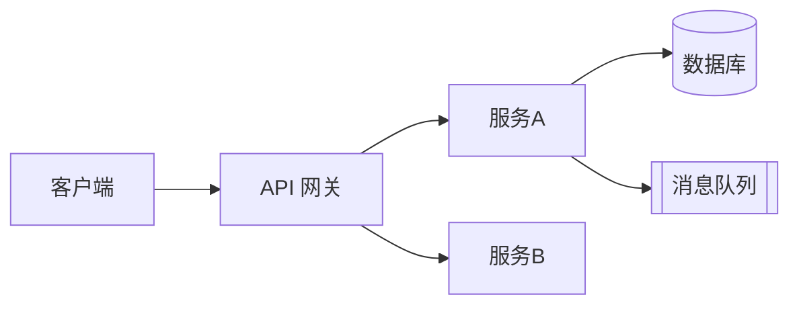
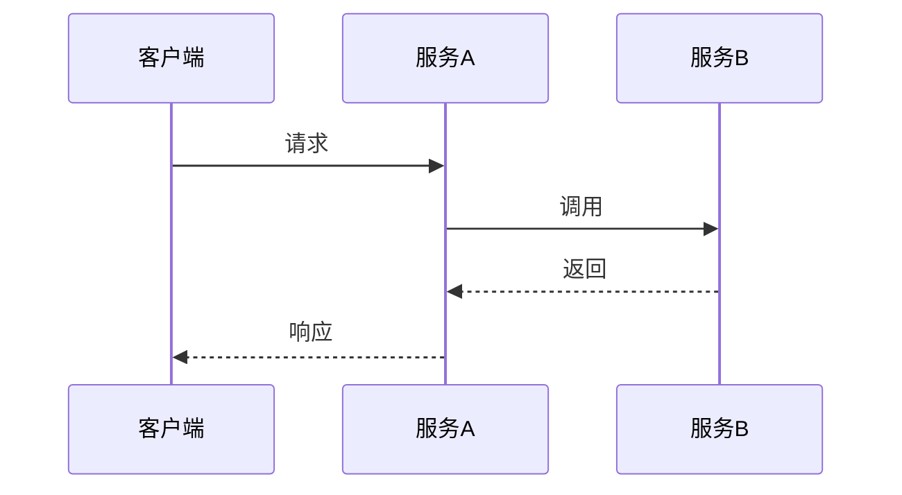
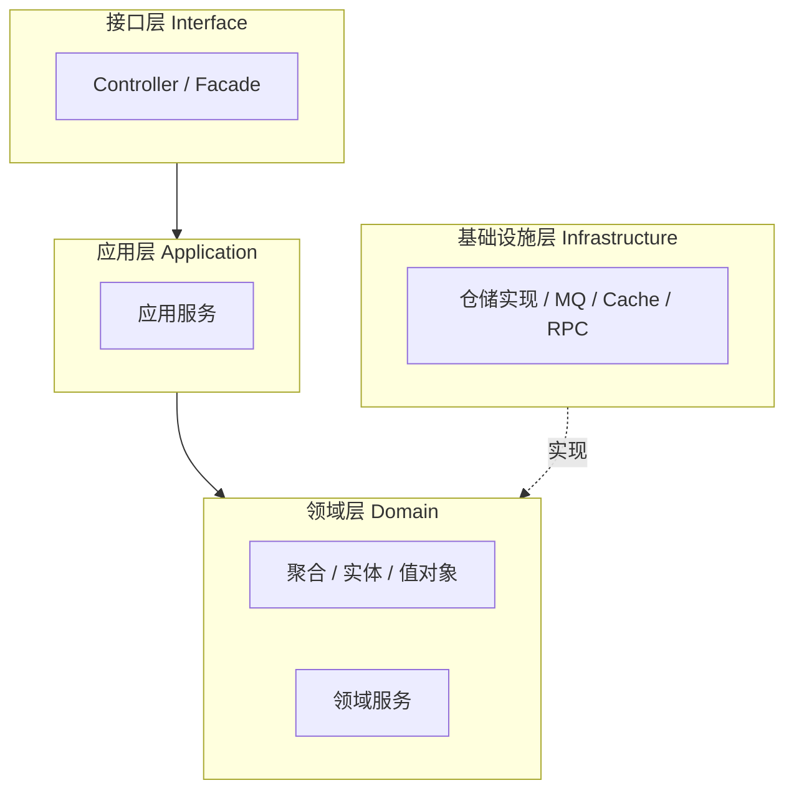
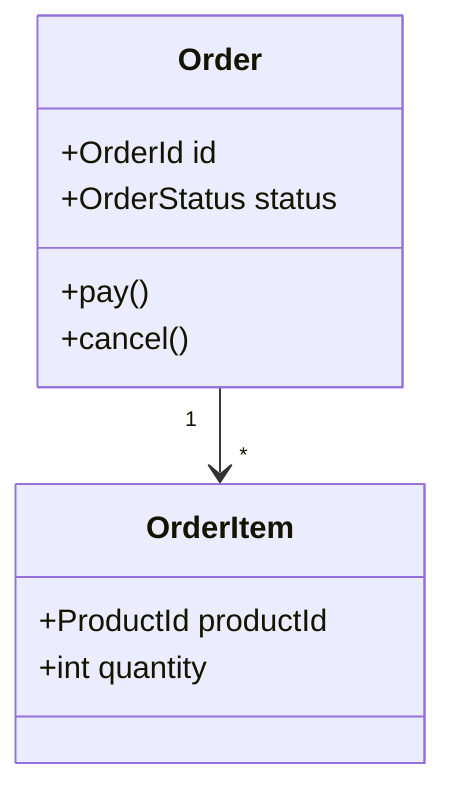
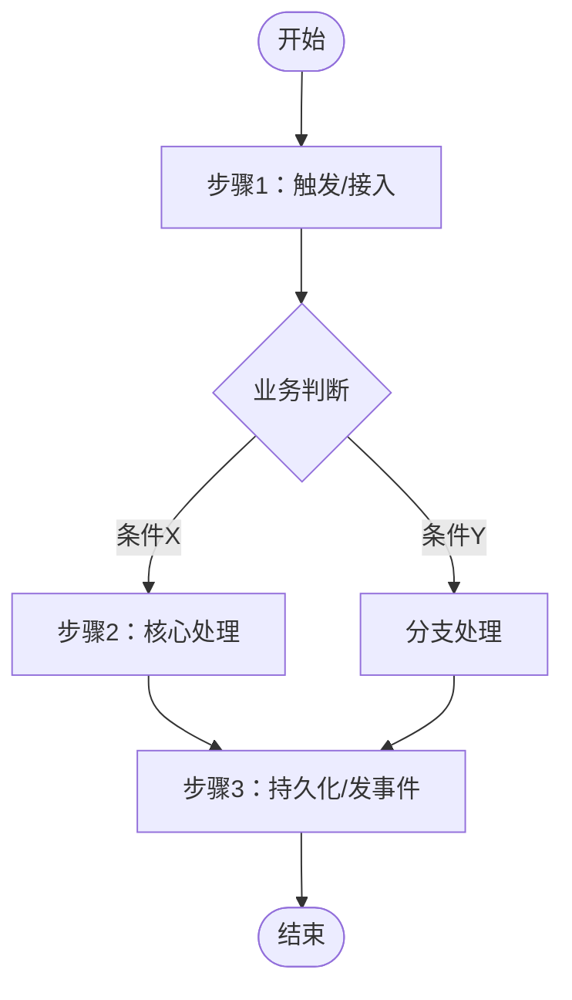
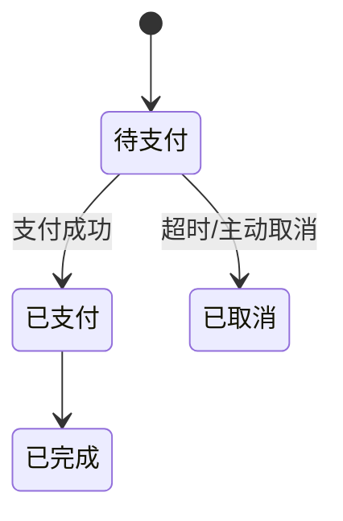

# 技术方案模板

> **适用范围**：本模板面向**业务型项目**（有明确业务规则、领域模型、业务流程的系统，如交易、订单、营销、结算等），按 DDD 战略设计 + 战术设计组织。中间件/工具类/纯技术基建项目可按需裁剪。
> **文档版本**：v2.1
> **创建日期**：YYYY-MM-DD
> **最后更新**：YYYY-MM-DD
> **文档状态**：[草稿 | 评审中 | 已通过 | 已废弃]

---

## 一、背景

### 1.1 业务背景
[描述项目所处的业务环境、要解决的业务问题，以及为什么现在要做]

### 1.2 现状与问题
[当前系统/流程的现状、痛点、约束。可用表格列出问题与影响]

| 问题 | 现象 | 影响 |
|------|------|------|
| [问题1] | | |

### 1.3 范围与边界
- **本次范围（In Scope）**：[明确包含什么]
- **不在范围（Out of Scope）**：[明确不做什么，避免范围蔓延]
- **相关系统/上下游**：[与哪些系统交互]

### 1.4 需求摘要
[从 PRD 提炼的核心功能需求与关键用例；详细需求引用 PRD，不在此重复]

| 需求ID | 需求描述 | 优先级 |
|--------|---------|--------|
| FR-001 | | P0/P1/P2 |

---

## 二、目标

### 2.1 业务目标
- [可量化的业务目标，如转化率提升 X%、成本下降 Y%]

### 2.2 技术目标

| 类别 | 指标 | 目标值 |
|------|------|--------|
| 性能 | QPS / P95 响应时间 | |
| 可用性 | SLA | 99.9% |
| 可扩展性 | [水平扩展能力、扩展点] | |
| 可维护性 | [模块解耦、演进成本] | |

### 2.3 非目标（Non-Goals）
[明确本方案不解决的问题，防止被误读为承诺]

---

## 三、战略设计

> 战略设计关注**宏观边界与结构**：系统如何拆分、分几层、领域如何划分。

### 3.1 系统架构

#### 3.1.1 架构选型与技术栈
[为什么选择该架构形态（单体/微服务/事件驱动等），考虑了哪些因素]

| 类别 | 技术选型 | 选择理由 | 备选方案 |
|------|---------|---------|---------|
| 开发语言 | | | |
| 框架 | | | |
| 数据库 | | | |
| 缓存 / MQ | | | |

#### 3.1.2 系统架构图

[说明：核心组件、部署形态、外部依赖]

#### 3.1.3 限界上下文划分
[若采用 DDD，列出限界上下文及其职责；非 DDD 项目则列模块划分]

| 限界上下文/模块 | 职责 | 上下游依赖 | 负责人 |
|----------------|------|-----------|--------|
| | | | |

#### 3.1.4 关键数据流/时序
[核心业务链路的数据流或时序图]

### 3.2 分层架构

#### 3.2.1 分层架构图

#### 3.2.2 各层职责

| 层 | 职责 | 允许依赖 | 关键组件 |
|----|------|---------|---------|
| 接口层 | 协议适配、参数校验、DTO 转换 | 应用层 | Controller, Assembler |
| 应用层 | 用例编排、事务边界、安全上下文 | 领域层 | ApplicationService, Command/Query |
| 领域层 | 核心业务规则、聚合、领域服务 | 无（依赖倒置） | Aggregate, Entity, VO, DomainService, Repository 接口 |
| 基础设施层 | 持久化、外部调用、消息、缓存 | 领域层（实现其接口） | RepositoryImpl, MQ, Cache, Client |

> 分层依赖规则：上层可依赖下层，**领域层不依赖任何外层**；基础设施层通过实现领域层定义的接口（依赖倒置）接入。

### 3.3 领域模型

#### 3.3.1 上下文映射图（Context Map）
[描述限界上下文之间的关系：合作模式（ACL/OHS/PL/CF 等）、集成方式]

#### 3.3.2 核心领域模型（类图）

#### 3.3.3 核心领域对象定义

| 领域对象 | 类型 | 职责/不变式 |
|---------|------|------------|
| | 聚合根/实体/值对象/领域事件 | |

#### 3.3.4 领域事件
[跨上下文/跨服务通信的关键领域事件]

| 事件名 | 发布方 | 触发时机 | 消费方 | Payload 关键字段 |
|--------|-------|---------|--------|-----------------|
| | | | | |

---

## 四、战术设计

> 战术设计关注**落地实现**：领域对象如何组织、接口如何定义、数据如何存储。

### 4.0 核心业务流程图

> 用一张主流程图串起核心业务链路（状态流转 + 关键操作 + 参与角色/系统），是后续领域设计、接口设计、数据库设计的共同线索。复杂分支可另用子流程/状态图补充。

**流程说明：**

| 步骤 | 触发方 | 关键操作 | 涉及领域对象 | 输出/事件 |
|------|-------|---------|------------|----------|
| | | | | |

**关键状态机**（如有）：

### 4.1 领域设计

#### 4.1.1 聚合设计
[逐个聚合说明：聚合根、边界、不变式、事务一致性边界]

- **聚合 {名称}**
  - 聚合根：
  - 内部实体/值对象：
  - 不变式（Invariants）：
  - 事务边界：[强一致范围]
  - 设计原则：[聚合间通过 ID 引用，不在一个聚合内 hold 其他聚合根的对象引用]

#### 4.1.2 领域服务与应用服务
[不适合放在聚合内的跨实体业务逻辑 → 领域服务；用例编排、事务 → 应用服务]

| 服务 | 类型（应用/领域） | 职责 |
|------|-----------------|------|
| | | |

#### 4.1.3 仓储设计
[每个聚合根对应一个仓储接口，定义在领域层，实现在基础设施层]

| 仓储接口 | 所属聚合 | 关键方法 | 实现方式 |
|---------|---------|---------|---------|
| | | | |

#### 4.1.4 领域对象 ↔ 代码映射表

> 本表是**领域模型到代码模型的可追溯映射**，确保每个领域概念在代码中都有落点，避免"两张皮"。按微服务/聚合分组填写。

| 微服务 | 层 | 聚合 | 领域对象 | 领域类型 | 依赖的领域对象 | 包名 | 类名 | 方法名 |
|--------|----|------|---------|---------|---------------|------|------|--------|
| order-service | 接口层 | 订单 | OrderController | 接口服务 | OrderAppService | com.x.order.interfaces | OrderController | createOrder() |
| order-service | 应用层 | 订单 | OrderAppService | 应用服务 | Order, OrderRepository | com.x.order.application | OrderAppService | createOrder() |
| order-service | 领域层 | 订单 | Order | 聚合根 | OrderItem, Address | com.x.order.domain.order | Order | pay()/cancel() |
| order-service | 领域层 | 订单 | OrderItem | 实体 | ProductId | com.x.order.domain.order | OrderItem | — |
| order-service | 领域层 | 订单 | Address | 值对象 | — | com.x.order.domain.order | Address | — |
| order-service | 领域层 | 订单 | OrderPaidEvent | 领域事件 | Order | com.x.order.domain.order | OrderPaidEvent | — |
| order-service | 领域层 | 订单 | OrderRepository | 仓储服务 | Order | com.x.order.domain.order | OrderRepository | save()/findById() |
| order-service | 领域层 | 订单 | PricingService | 领域服务 | Order, Product | com.x.order.domain.order | PricingService | calculate() |
| order-service | 基础层 | 订单 | OrderRepositoryImpl | 仓储实现 | OrderRepository | com.x.order.infrastructure | OrderRepositoryImpl | save()/findById() |

**字段填写说明：**

- **微服务**：领域对象所属的服务/可部署单元；单体项目填应用名即可。
- **层**：对象所在的分层——接口层 / 应用层 / 领域层 / 基础设施层。
- **聚合**：对象归属的聚合（限界上下文内的聚合边界）。
- **领域对象**：领域模型中的具体名称（统一语言中的术语）。
- **领域类型**：DDD 体系中的类型——限界上下文 / 聚合 / 聚合根 / 实体 / 值对象 / 领域事件 / 应用服务 / 领域服务 / 仓储服务（接口）。
- **依赖的领域对象**：该对象调用、引用或聚合的其他领域对象（体现服务调用、对象关联、聚合组成）。
- **包名**：代码模型中的软件包路径。
- **类名**：对应的类/接口名。
- **方法名**：该对象承载的关键方法；实体/值对象若无独立方法可填 `—`。

### 4.2 接口设计

> 接口/API 内容较多时，按 SKILL 约定拆分为 `design-api.md`，主文档只保留原则与清单索引。

#### 4.2.1 设计原则
- 风格：[RESTful / RPC / GraphQL]
- 幂等性：[写接口的幂等要求与实现方式]
- 统一规约：[请求/响应包装、分页、错误码、版本化]

#### 4.2.2 核心接口清单

| 接口 | 方法 | 路径/方法签名 | 说明 | 幂等 |
|------|------|--------------|------|------|
| 创建订单 | POST | /api/orders | | 是 |

#### 4.2.3 接口契约
[关键接口的请求/响应字段、错误码；多则拆子文档]

### 4.3 数据库设计

> 表结构/DDL 较多时拆分为 `design-database.md`，主文档保留选型与核心表摘要。

#### 4.3.1 数据库选型
[选型理由、读写分离/分库分表策略]

#### 4.3.2 核心表结构

##### 表：t_order
| 字段 | 类型 | 可空 | 索引 | 说明 |
|------|------|------|------|------|
| id | BIGINT | NO | PK | 主键 |
| order_no | VARCHAR(64) | NO | UNIQUE | 订单号 |
| status | VARCHAR(32) | NO | IDX | 订单状态 |
| amount | DECIMAL(18,2) | NO | | 金额 |

#### 4.3.3 索引与缓存策略
- 索引：[核心查询的索引设计]
- 缓存：[缓存粒度、Cache Aside/Write Through、失效策略]

#### 4.3.4 数据一致性
[聚合内强一致、跨聚合/跨服务最终一致的方案：本地消息表、事务消息、Saga 等]

---

## 详细方案索引

> 篇幅较大的主题拆为子文档独立维护，在此登记。

| 文档 | 说明 | 最后更新 |
|------|------|---------|
| design-api.md | 接口设计（如已拆分） | |
| design-database.md | 数据库设计（如已拆分） | |
| adr/ | 架构决策记录目录 | |

---

## 附录

### 架构决策记录（ADR 索引）
| ADR编号 | 决策标题 | 状态 | 链接 |
|---------|---------|------|------|
| ADR-001 | | 已通过 | |

### 变更记录
| 版本 | 日期 | 修改人 | 修改内容 |
|------|------|--------|---------|
| v2.1 | YYYY-MM-DD | | 战术设计新增核心业务流程图；注明适用范围为业务型项目 |
| v2.0 | YYYY-MM-DD | | 重构为战略设计+战术设计结构，新增领域对象↔代码映射表 |
| v1.0 | YYYY-MM-DD | | 初始版本 |
