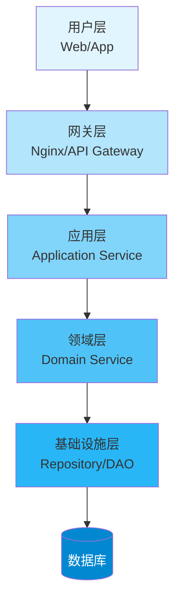
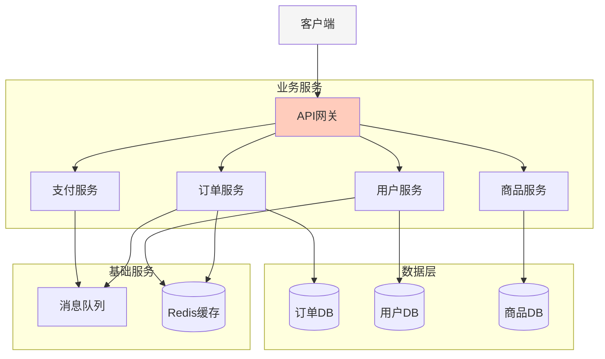
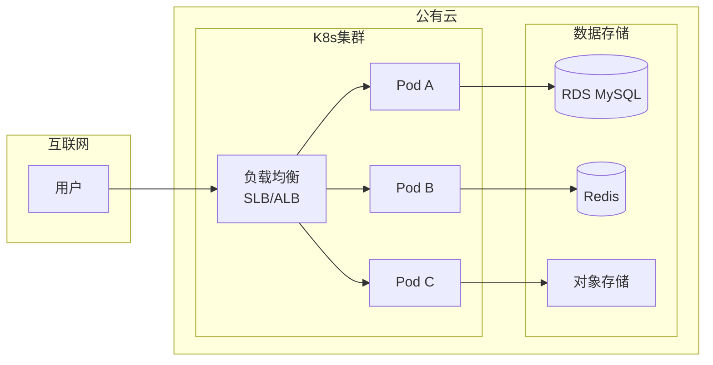
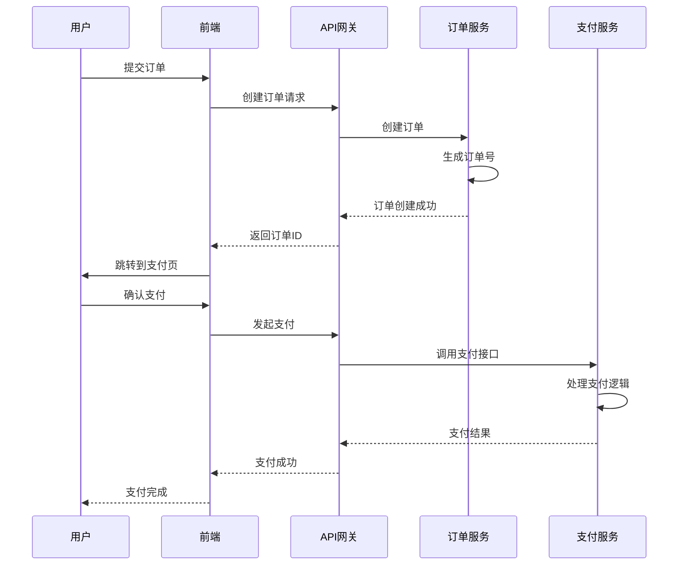
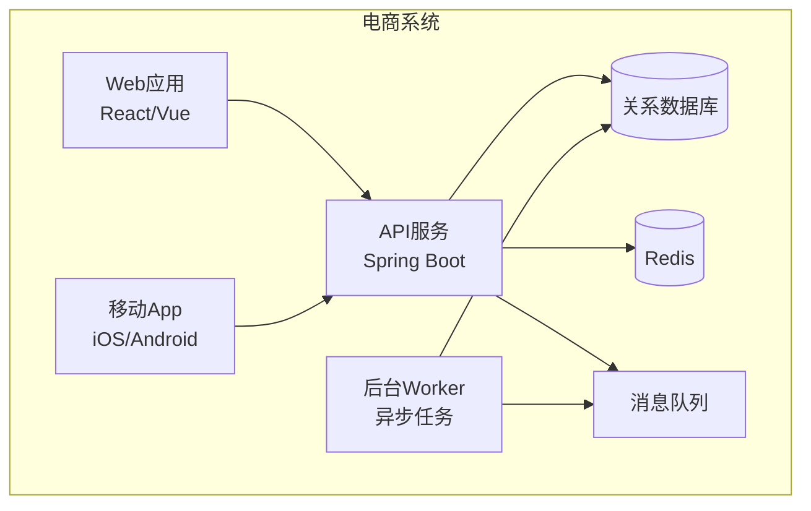
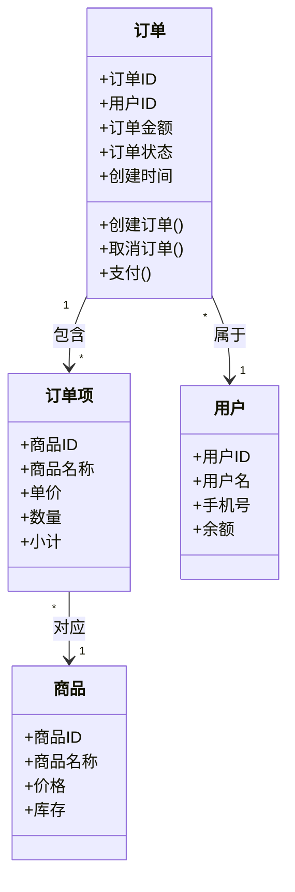

# Mermaid 架构图示例

## 1. 分层架构图

## 2. 微服务架构图

## 3. 部署架构图

## 4. 时序图 - 用户下单

## 5. C4模型 - Container图

## 6. DDD 领域模型图

## 使用建议

1. **优先使用文字描述**：复杂架构先用文字说明，再考虑画图
2. **保持简洁**：一张图不要超过10个节点，否则可读性差
3. **分层清晰**：使用不同颜色区分不同层级
4. **粒度适中**：根据文档目的选择合适的抽象级别
5. **配合说明**：图下必须有文字说明，不要只放图
