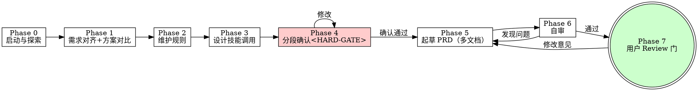

# PRD 撰写

创建和维护清晰、完整、可评审、可拆解、适合实现的产品需求文档。

---

## 职责边界

本技能**只创建或维护 PRD 文档**，不做代码实现。PRD 的读者包括产品、开发、测试和 AI Agent，因此必须明确、无歧义、可验证。

本技能处理四种任务类型：

1. **新建 PRD**：当前产品/项目还没有 PRD，接收描述后澄清关键问题、生成结构化 PRD。
2. **维护已有 PRD**：已有 PRD 存在时，在原文档上修改，保留变更历史。
3. **完善 PRD 模板**：用户要求完善模板时，基于 `references/PRD_TEMPLATES.md` 补齐指定位置。
4. **改写/补全已有 PRD**：基于已有内容补齐缺失章节、统一结构、提升可执行性，保留历史记录。

---

## 路径约定

**项目文档目录自动探测**（不硬编码 `docs/`）：用户指定 &gt; `docs/README.md` &gt; 已有 prd 所在目录。**必须先读文档根下的 `README.md`**，按其指引定位目录。

**输出目录**：默认 `docs/prd/`（多文档结构），用户指定则按指定路径。

---

## 工作流

按 Phase 0 → 7 顺序执行。每个 Phase 完成后再进入下一个。



### Phase 0: 启动与探索

1. **探索项目上下文**：
  - 读文档根目录 `README.md` 了解现有文档结构
  - 检查近期提交（`git log --oneline -10`）了解项目状态
  - Glob 查找已有 PRD：查找 `docs/prd/`、`docs/prd.md` 等
2. 找到多个候选时，使用 AskUserQuestion 询问用户选择目标。
3. 确定任务类型（新建/维护/完善模板/改写补全）。
4. 若任务是维护已有 PRD，先 Read 原文档，保留章节结构和历史记录。
5. **范围判断**：如果请求描述了多个独立子系统（例如"做一个平台，含聊天、文件存储、计费、分析"），先提示用户拆分为子项目，对第一个子项目走正常流程。每个子项目有独立的 PRD → 架构 → 实现周期。

### Phase 1: 需求对齐（逐条提问 + 方案对比）

#### 1.1 逐条提问

本阶段采用**一次只问一个问题**的方式与用户对齐。每个问题必须使用 AskUserQuestion 给出 2-4 个选项和你推荐的答案，根据回答裁剪问题。

按以下决策树逐条推进（按顺序，可裁剪）：

**Q1. 问题与目标**
该产品/功能/变更解决什么问题？成功后用户/业务获得什么？

**Q2. 目标用户**
谁会使用（终端用户）、谁运营、谁审批？

**Q3. 核心流程**
用户在什么场景下做什么，期望得到什么结果？（用"谁在什么场景下，做什么事情，要达到什么目的，获得什么结果"公式）

**Q4. 范围与边界**
包含什么，不包含什么？哪些在本期范围外？

**Q5. 变更位置**（维护类需求）
是新增功能、修改已有功能、删除/废弃功能？对应功能编号是什么？

**Q6. 依赖与约束**
依赖哪些系统、权限、数据、接口、运营流程？有无技术约束或上线时间约束？

**Q7. 成功标准**
如何判断需求完成且有效？有哪些可量化的指标或验收信号？

**Q8. 风险**
是否涉及资损、权限、安全、合规、财务、履约风险？（涉及资金/订单/余额/积分/优惠券/佣金/用户信息必须深挖）

**Q9. UI/UX 设计决策**
本需求是否涉及以下任一项？

- A. 新增页面或视图
- B. 对已有页面进行视觉改版
- C. 需要确定布局、视觉风格、配色、字体
- D. 需要确定组件规范或交互模式
- E. 需要确定响应式策略或可访问性要求
- F. 以上都没有（纯后端/API/数据/文案微调/非可视任务）

若选 A-E：记录设计决策点清单（style、color、typography、layout、components、interaction、responsive/a11y），进入 Phase 3.1。
若选 F：跳过 UI/UX 调用。

**Q10. 数据可视化需求**
PRD 是否需要包含图表、图形、仪表盘或数据可视化？

- 是：记录图表类型与数据维度，进入 Phase 3.2。
- 否：跳过。

> **反模式**：不要一次问多个问题；不要不给推荐答案让用户从零思考；不要把所有 Q1-Q10 全问一遍——根据回答裁剪。纯后端需求跳过 Q9/Q10，新建需求跳过 Q5。

#### 1.2 方案对比（YAGNI）

当需求存在多种实现路径时（非简单 CRUD 或明确需求），提出 2-3 个方案：

- 每个方案包含核心思路、主要 trade-off、适用场景
- 给出你的推荐方案及理由
- 明确指出不推荐其他方案的原因
- YAGNI：每个方案都要砍掉不必要的功能

需求极明确时（如"按既有模式加 CRUD 模块"）可跳过本步骤。

### Phase 2: 维护已有 PRD 的规则

当任务是变更已有 PRD 时（任务类型 2 或 4），执行以下规则：

1. **在原文档上修改**，不为每次变更新建独立 PRD。多文档模式下修改对应子文档。
2. **功能级变更记录**：某功能发生新增、修改、删除、废弃、规则调整、页面调整、接口调整、字段调整时，在 `features.md` 中该功能章节下维护：
  - `### 历史版本`（版本、日期、变更类型、摘要、影响范围、作者）
  - `### 变更记录`（日期、变更前、变更后、原因、关联来源）
3. **文档级变更记录**：PRD 结构、全局目标、发版计划、依赖系统、风险管理、非功能需求等全局内容变更，更新主文档 `README.md` 的"文档记录"。
4. **正文同步更新**：历史记录不替代正文，变更后功能正文、流程、页面交互、处理逻辑、验收标准等当前有效内容必须同步更新。
5. **子文档变更**：若变更仅涉及某子文档主题（如只改 UI/UX），只更新对应子文档，主文档索引表更新"最后更新"日期。

### Phase 3: 设计技能调用（条件触发）

#### Phase 3.1: UI/UX 设计规范

当 Q9 判定涉及 UI/UX 设计决策时：

1. 使用 `Skill` 工具调用 `ui-ux-pro-max`，传入：产品/功能类型、目标用户与场景、Q9 记录的设计决策点清单、目标技术栈（如 Vue/Ant Design Vue、uni-app、React 等）。
2. 将返回结论提炼为 7 个维度：
  - 风格定位（Style）
  - 色板（Color Palette，含语义色 token）
  - 字体与排版（Typography）
  - 间距与布局系统（Spacing &amp; Layout）
  - 关键组件规范（Key Components）
  - 交互模式与动效（Interaction &amp; Motion）
  - 响应式/可访问性（Responsive &amp; Accessibility）
3. 基于上述设计规范，梳理页面原型：
  - 列出所有页面/视图清单及其导航关系
  - 每个页面描述：布局结构、核心区域、关键组件、数据展示、交互行为
  - 页面间跳转关系和状态流转
  - 使用 Mermaid 绘制页面流程图，用文字线框图描述页面布局
4. 将 UI/UX 设计规范 + 页面原型统一写入 `prototype.md` 子文档。
5. 若调用失败或结论不明确，在主文档「待解决问题」中标注「页面原型未完成」，列出具体待决项，PRD 其他部分继续输出（不阻塞）。

纯后端逻辑、API/数据库设计、基础设施、非可视脚本不触发本步骤。

#### Phase 3.2: 数据可视化设计

当 Q10 判定需要图表/数据可视化时：

1. 使用 `Skill` 工具调用 `dataviz`，传入：可视化目标、数据维度、目标技术栈、受众。
2. 将结论（图表类型选择、配色、交互、可访问性）融入对应页面原型描述或 `prototype.md`。
3. 失败处理同 Phase 3.1：标注待决，继续输出。

流程图、ER 图、时序图、用例图、状态图等使用 Mermaid 语法直接写在 PRD 中，无需外部技能。

### Phase 4: 分段确认 <HARD-GATE>

<HARD-GATE>

在起草 PRD 文档前，必须先分段呈现关键设计决策并获得用户确认。未经用户确认不得进入文档编写阶段。

</HARD-GATE>

将 Phase 1-3 收集到的信息按以下分段逐段呈现，每段确认后继续：

1. **核心问题与目标**：背景、目标、成功标准
2. **范围与功能清单**：功能列表（F01/F02...）、优先级、非目标
3. **核心流程**：端到端业务流程（文字或 Mermaid）
4. **关键设计决策**：方案对比结论、UI/UX 方向、技术约束

呈现方式：每段简短描述，附"是否正确？有需要调整的吗？"。有异议返回修改对应段，全部确认后进入 Phase 5。

### Phase 5: 起草 PRD（多文档）

#### 5.1 文档拆分规则

**输出目录**：`docs/prd/`（默认）。

**拆分原则**（参考 architecture skill）：主文档保留总纲，某部分内容相对独立或篇幅较大时拆为子文档。模板是**检查清单**，不涉及的子文档直接省略，不要为了凑模板创建空文档。


| 文档                  | 内容                                                  | 何时创建            |
| ------------------- | --------------------------------------------------- | --------------- |
| `README.md`（主文档）    | 文档信息、背景目标、范围总纲、功能清单索引、核心流程概览、非功能摘要、风险摘要、待解决问题、文档索引表 | **必建**          |
| `features.md`       | 功能需求详细描述（按功能模块，含编号、业务规则、验收标准、异常处理、变更记录）             | **必建**          |
| `user-stories.md`   | 用户故事、角色定义、用例描述、详细流程时序图                              | 用户角色复杂或流程复杂时创建  |
| `prototype.md`      | 页面原型 + UI/UX 设计规范（7 维度结论 + 页面清单/布局/流程/线框图）      | Phase 3.1 触发时创建 |
| `non-functional.md` | 非功能需求详情（性能、安全、可用性、兼容性）                              | 非功能需求较多或复杂时创建   |
| `data-model.md`     | 数据模型、ER 图、状态机、数据约束                                  | 涉及数据设计时创建       |
| `risks.md`          | 资损风险、技术风险、外部依赖、约束假设                                 | 涉及资损或风险较多时创建    |


**主文档末尾必须维护「PRD 文档索引」表**：

```markdown
## PRD 文档索引
| 文档 | 说明 | 最后更新 |
|------|------|---------|
| features.md | 功能需求详细描述 | YYYY-MM-DD |
| prototype.md | 页面原型 + UI/UX 设计规范 | YYYY-MM-DD |
```

**小型需求**（单个功能点、Bug 修复、简单变更）可只用 `README.md` + `features.md`，不拆其他子文档。

#### 5.2 起草步骤

1. Read `references/PRD_TEMPLATES.md`（与本 SKILL.md 同目录），使用其中的模板。
2. 先创建主文档 `README.md` 骨架和索引表，再逐个创建需要的子文档。
3. 功能需求必须可验证，不写"正常工作""优化体验"等含糊表述。
4. 若涉及界面，描述页面交互、校验、异常提示，在验收标准中要求真实界面验证。
5. 若涉及系统实现，写明依赖系统、接口、数据、权限、状态流转、异常处理。
6. 将 UI/UX 7 维度结论 + 页面原型写入 `prototype.md`，数据可视化结论融入对应位置。
7. 若信息缺失，不要编造关键事实；在主文档「待解决问题」中标注。
8. 使用 Write 工具输出。已有 PRD 存在时，对已有文件使用 Edit 修改，不新建重复文件。
9. 每个子文档末尾维护变更记录（追加式，不覆盖历史）。

### Phase 6: 自审

写完所有文档后，通读自查，逐项修复发现的问题：

**1. 占位符扫描**

- 是否存在 TBD、TODO、"待补充"、空章节？补全或移到「待解决问题」。

**2. 内部一致性**

- 各子文档之间是否有矛盾？功能清单编号是否与 features.md 一致？
- 主文档索引表是否覆盖所有创建的子文档？

**3. 范围检查**

- 是否聚焦单个项目/子项目？是否混入了不相关的需求？

**4. 歧义检查**

- 某条需求是否可以被两种不同方式解读？若是，明确选一种并写清楚。
- 验收标准是否可验证（具体、可执行、有预期结果）？

**5. 完整性检查**（对照 Phase 5 自检清单）

发现问题直接修复，无需重新确认——修复后直接进入 Phase 7。

### Phase 7: 用户 Review 门

自审通过后，告知用户：

> "PRD 已写入 `docs/prd/` 目录（主文档 `docs/prd/README.md`）。请 review 以下文档：
>
> - 主文档：docs/prd/README.md
> - 功能详情：docs/prd/features.md
> - {其他创建的子文档列表}
>
> 如有修改意见请告诉我，确认无误后我将标记 PRD 为已确认状态。"

等待用户反馈：

- 有修改意见：回到 Phase 5 修改对应文档，修改后重新自审受影响部分
- 用户确认：将主文档状态从"草稿"改为"已确认"，汇报完成

**HARD-GATE**：只有用户 review 确认后的 PRD 才能被 flow skill 或 architecture skill 消费。

---

## 输出规范

- **格式**：Markdown（`.md`）
- **默认位置**：`docs/prd/`
- **主文档**：`docs/prd/README.md`
- **子文档**：`docs/prd/{name}.md`
- 用户明确指定路径时按用户指定执行。
- 已有 PRD 存在时，输出为对已有文件的修改结果（Edit），不新建重复文件。

---

## 返回值

被 leader/flow 编排时**不回传全文**，只返回：

```
产物路径：
- 主文档：docs/prd/README.md
- features：docs/prd/features.md
- {其他子文档}
任务类型：新建/维护/改写
结论：待用户 review / 已确认
摘要（≤5行）：
- 功能清单：F01 xxx, F02 xxx
- 子文档：features.md, prototype.md
- 待解决问题：N 项
```

独立调用时把摘要和路径告知用户即可。

---

## 打包文件

所有模板和引用文件都在本 skill 目录下：

- `references/PRD_TEMPLATES.md` — PRD 模板集（主文档+所有子文档模板），生成/完善/改写 PRD 时必须读取
- `docs/2026-07-26-prd-uiux-linkage-design.md` — UI/UX 联动设计记录（参考用）

